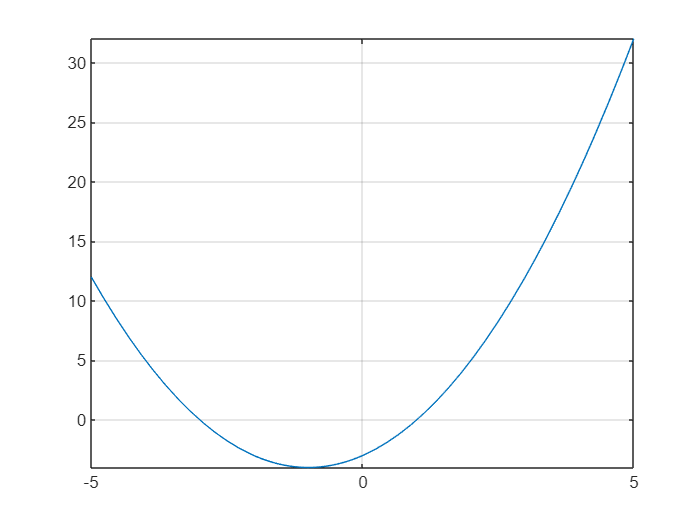

# <span style="color:rgb(213,80,0)">Kvadratické rovnice</span> [](https://matlab.mathworks.com/open/github/v1?repo=mblaho/KvadratickaRovnica&file=Pr01_Teoria.mlx)

**Kvadratická rovnica** je rovnica, v ktorej se vyskytuje jedna neznáma v druhej mocnine. **Základný tvar** kvadratickej rovnice je:

 $$ {\textrm{ax}}^2 +bx+c=0 $$ 

kde *a,b,c* sú reálne čísla a $a\not= 0$ . Pri kvadratických rovniciach používame nasledujúce názvoslovie:

-  ${\textrm{ax}}^2$ je **kvadratický člen**, 
-  $\textrm{bx}$ je **lineárny člen**, 
-  $c$ je **absolútny člen**. 

Príkladom kvadratickej rovnice je $2x^2 +6x-20=0$ . V tejto rovnici je kvadratický člen $2x^2$ , lineárny člen $6x$ a absolútny člen $-20$ . Korene tejto rovnice sú *2* a *\-5*.


**Špeciálne typy** kvadratických rovníc:

-  Ak je $b=0$ nazývame rovnicu **rýdzo kvadratickou**: ${\textrm{ax}}^2 +c=0$ . 
-  Ak je $c=0$ hovoríme o rovnici **bez absolútneho člena**: ${\textrm{ax}}^2 +\textrm{bx}=0$ . 
## **Riešenie kvadratickej rovnice**

Každú kvadratickú rovnicu je možné riešiť pomocou výpočtu **diskriminantu** *D*. Preň platí: $D=b^2 -4\textrm{ac}$ . Môžu nastať 3 situácie:

-  $D<0$ – rovnica **nemá** v reálnych číslach riešenie. 
-  $D=0$ – rovnica má **jeden** dvojnásobný koreň. 
-  $D>0$ – rovnica má **dva** rôzne reálne korene. 

Pre korene rovnice platí:

-  $\displaystyle x_1 =\frac{-b+\sqrt{D}}{2a}$ 
-  $\displaystyle x_2 =\frac{-b-\sqrt{D}}{2a}$ 

Kvadratické rovnice môžeme riešiť aj bez počítania diskriminantu napríklad pomocou využitia **Vietových vzťahov.**

# Literatúra
1.  [**Vieme matiku**](https://www.viemematiku.sk/book/cvicenia-riesenie-kvadraticke-rovnice)
# Numerické riešenie kvadratickej rovnice v prostredí MATLAB

Pomocou vyššie uvedených vzťahov vyriešte nasledujúcu kvadratickú rovnicu:

 $$ x^2 +2x-3=0 $$ 

Koeficienty rovnice:

```matlab
a=1;
b=2;
c=-3;
```

Diskriminant:

```matlab
D=b^2-4*a*c
```

```matlabTextOutput
D = 16
```

1. Koreň

```matlab
x1 = (-b+sqrt(D))/(2*a)
```

```matlabTextOutput
x1 = 1
```

2. Koreň

```matlab
x2 = (-b-sqrt(D))/(2*a)
```

```matlabTextOutput
x2 = -3
```
# Graf kvadratickej rovnice

Kvadratickú rovnicu môžeme vizualizovať pomocou grafu

```matlab
x=-5:0.1:5;
y=a.*x.^2+b.*x+c;
plot(x,y)
hold on
grid on
plot(x1,0,'or')
plot(x2,0,'og')
hold off
title('Graf kvadratickej rovnice');
```

<center></center>

# Symbolické riešenie kvadratickej rovnice v prostredí MATLAB

Kvadratickú rovnicu vyššie vypočítajte a vizualizujte pomocou symbolickej matematiky

```matlab
syms x a2 b2 c2
f=a2*x^2+b2*x+c2
```
f = 
 $\displaystyle a_2 \,x^2 +b_2 \,x+c_2 $
 

```matlab
f = subs(f,[a2,b2,c2],[a,b,c])
```
f = 
 $\displaystyle x^2 +2\,x-3$
 

```matlab
fplot(f)
grid on
```

<center></center>


```matlab
solution = solve(f,x)
```
solution = 
 $\displaystyle \left(\begin{array}{c} -3\newline 1 \end{array}\right)$
 
